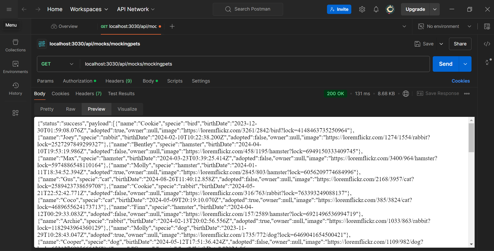
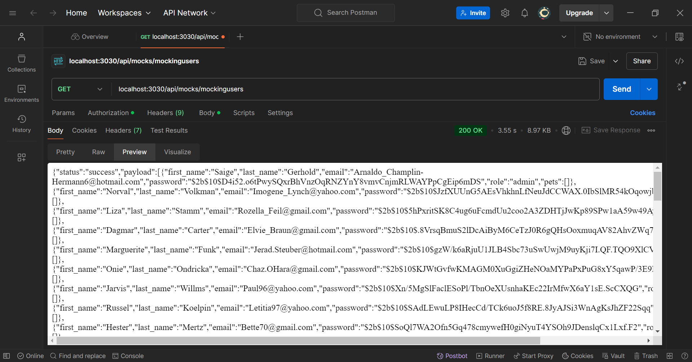
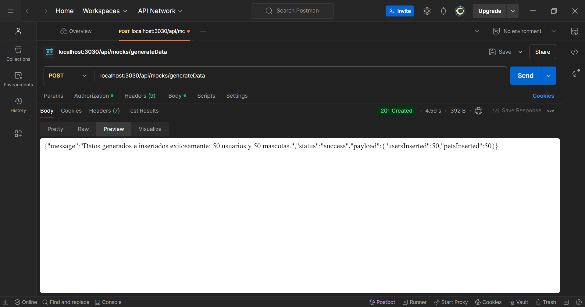

# project-backend3
## Proyecto para datos de usuarios y mascotas

Este proyecto permite generar datos para colecciones de usuarios y mascotas, utilizando la biblioteca **Faker**. Los datos generados se insertan en la base de datos, facilitando la realización con datos ficticios.

## Requisitos 

- Instalación **Node.js** y **npm**.
- **MongoDB** (URL para la conexión a la base de datos).

## Instalación

   **<u>La información sensible de las variables se han mandado junto con la entrega</u>** 

1. Clonar el repositorio:
   ```bash
   git clone https://github.com/KeylaMunoz/project-backend3.git
   cd project-backend3
   ``` 
2. Instalar dependencias:
   ```bash
   npm install
   ```
3. Crear archivo `.env` en la raíz del proyecto con la URL de conexión a MongoDB. (archivo `env.example`)
URL_MONGO=<url_de_mongodb>
PORT=<port>


4. Ejecutar el proyecto:
    ```bash
    node src/app.js
    ```
## Endpoints

### Generación de Datos de Prueba

**GET**

 /api/mocks/mockingpets -
 Genera y devuelve una lista de 50 mascotas ficticias sin insertarlas en la base de datos.

 

/api/mocks/mockingusers  -
Genera y devuelve una lista de 50 usuarios ficticios sin insertarlos en la base de datos.



**POST**
/api/mocks/generateData  - Genera e inserta datos ficticios de pets y users en la base de datos.
Query Parameters (opcional):
Users: Número de usuarios a generar (predeterminado: 50).
Pets: Número de mascotas a generar (predeterminado: 50).


